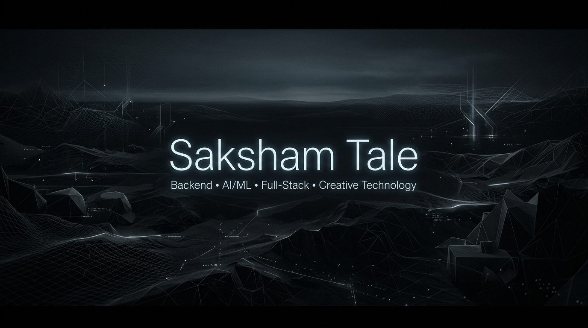
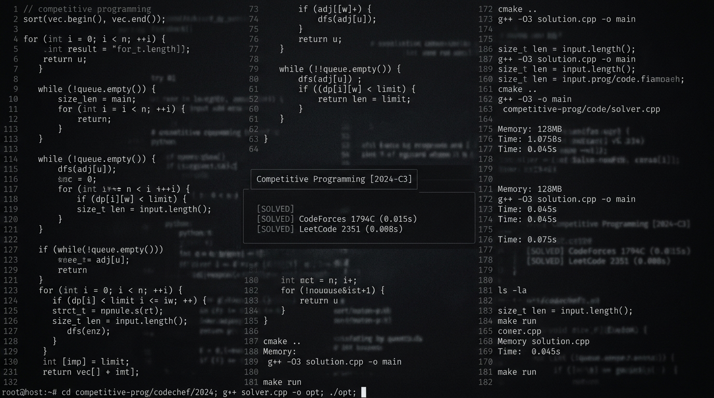
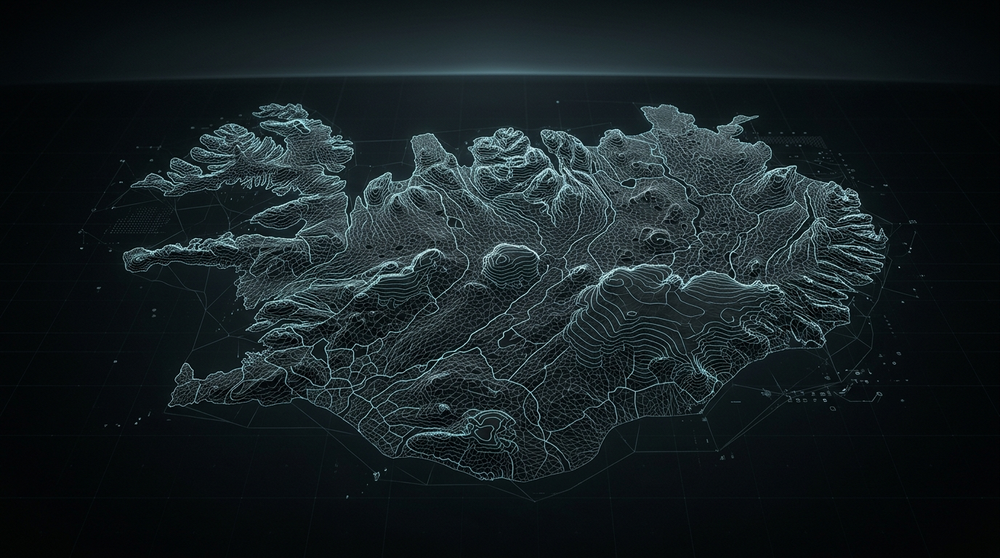

<div align="center">
  
</div>

```
================================================================================
  SYSTEM INIT :: SAKSHAM TALE [v2.4.0-nightly]
  LOCATION    :: 18.5204° N, 73.8567° E [PUNE, IN]
  STATUS      :: OPERATIONAL (compiling thoughts into executable binaries)
  UPTIME      :: 20+ years (occasional kernel panics at 3:00 AM)
================================================================================
```

<div align="center">
  I build backend engines, terminal developer tools, AI/vector search experiments, and procedural 3D worlds.<br>
  <b>Engineering doctrine:</b> If a manual workflow takes 30 seconds, I will happily spend 14 hours automating it in Python or C++.
</div>

<br>

<details>
<summary><b>[ CLICK TO INITIALIZE SHELL SESSION ]</b> <code>$ ./saksham --diagnostics</code></summary>

```bash
> Initializing environment...
[OK] Backend subsystems ........... Node.js, FastAPI, Express, REST APIs
[OK] Vector indices ............... Sentence Transformers, ChromaDB, Embeddings
[OK] CLI engine ................... Textual, Click, Rich, Curses
[OK] Procedural math .............. Voronoi, Delaunay, Poisson Disk, Lloyd Relaxation
[OK] Coffee level ................. 87% (Dark Roast)
[WARN] Sleep scheduler ............ Thread pool exhausted (SIGKILL ignored)
[INFO] System ready for execution.
```
</details>

<br><hr><br>

### SYSTEM THREADS // CURRENT STATUS

```
[THREAD-01] Building developer TUIs because GUIs have too much latency
[THREAD-02] Tweaking Voronoi cell relaxation on procedural terrain in HCTS
[THREAD-03] Fine-tuning legal embedding retrieval thresholds in LegalEye
[THREAD-04] Listening to synthwave / dark ambient while waiting for C++ builds
[THREAD-05] Wondering why code that passed yesterday is throwing SIGSEGV today
```

<br><hr><br>

### PROJECTS THAT ESCAPED THE IDE

```
root@machine:~/projects# tree -L 1 --sort=chaos
.
├── cfmate ............. fast Codeforces CLI; zero-context-switching problem solver
├── CaseCraft .......... terminal test-case manager & differential runner
├── LegalEye ........... semantic legal search with local-first vector embeddings
├── HCTS / Island ...... thermodynamics-driven procedural terrain generation engine
├── EasyMetro .......... graph-based transit routing and optimal pathfinder for Pune
├── POSTER ............. retro amber phosphor TUI client for REST APIs
└── youtubeButForMe .... distraction-free custom YouTube client
```

<br>

#### 01 :: CFMate // Competitive Programming CLI
> *Because opening a web browser to copy test cases felt like an unacceptable latency penalty.*

* **What it does:** Fetches Codeforces problems directly into the terminal, caches statements locally, parses sample inputs/outputs, and executes your Python/C++/Java/Go solutions against tests with zero context-switching.
* **Stack:** Python, CLI Scaffolding, Cache Engine, PyPI Distribution
* **Links:** [GitHub Repo](https://github.com/Saksham-cmd-tech/cf_tool) | [PyPI Package](https://pypi.org/project/cfmate/)

<div align="center">
  
</div>

<br>

#### 02 :: LegalEye // Semantic Legal Search Engine
> *What if searching legal precedents didn't feel like sifting through 19th-century filing cabinets?*

* **What it does:** Uses vector search and semantic document embeddings to query and retrieve legal contexts based on semantic intent rather than brittle keyword matching.
* **Stack:** Python, Sentence Transformers, Vector Search, Semantic Analysis
* **Links:** [GitHub Repo](https://github.com/Saksham-cmd-tech/LegelEye)

<div align="center">
  
</div>

<br>

#### 03 :: HCTS // Procedural Island & Terrain Engine
> *When standard Perlin noise isn't enough, simulate geology and thermodynamics.*

* **What it does:** High-performance procedural world generator leveraging Voronoi tessellations, Delaunay triangulation, Poisson disk sampling, and Lloyd relaxation to synthesize realistic landmasses, river basins, and elevation gradients.
* **Stack:** Procedural Math, Spatial Partitioning, 3D Mesh Generation, Unity / C++
* **Links:** [Research & Repository](https://github.com/Saksham-cmd-tech/terrain_research)

<div align="center">
  
</div>

<br>

#### 04 :: CaseCraft (CaseRunner) // Terminal Test Runner
> *A LazyGit-inspired test-case manager for algorithm builders and problem solvers.*

* **What it does:** Terminal UI for managing custom test cases, monitoring execution timeouts (TLE), memory footprint, and generating instant visual diffs between expected and actual outputs.
* **Stack:** Python, TUI, Process Isolation, Subprocess Execution
* **Links:** [GitHub Repo](https://github.com/Saksham-cmd-tech/caseRunner)

<br>

#### 05 :: EasyMetro // Transit Graph Pathfinder
> *Because computing Dijkstra on a graph was more reliable than looking at static timetable PDFs.*

* **What it does:** Route visualization, interchange optimization, and shortest-path calculation across Pune's transit networks.
* **Stack:** TypeScript, React, Graph Algorithms, Transit Data Parsing
* **Links:** [GitHub Repo](https://github.com/Saksham-cmd-tech/easyMetro)

<br>

#### 06 :: POSTER // Amber Phosphor TUI API Client
> *Because Postman takes 1.2 GB of RAM just to send a GET request.*

* **What it does:** Full keyboard-driven API workbench in the terminal with retro amber CRT aesthetics. Built with Textual.
* **Stack:** Python, Textual, HTTP Client Engine

<br><hr><br>

### EXPERIMENTS // THINGS THAT PROBABLY DIDN'T NEED TO EXIST

| Experiment | Why it was built | The realization |
| :--- | :--- | :--- |
| **CFMate** | Refused to alt-tab to Chrome during contests | Wrote 1,000+ lines of CLI code to save 3 seconds per problem |
| **POSTER** | Postman took 8 seconds to launch on my machine | Built a retro amber TUI with Textual instead of waiting |
| **youtubeButForMe** | YouTube algorithmic feeds kept recommending 3-hour video essays | Built a custom frontend with Firebase and React just to watch tutorials in peace |
| **EasyMetro Graph** | Wanted to know the exact transfer penalty at metro interchanges | Built a full TypeScript graph builder from raw transit stops |

<br><hr><br>

### RUNTIME LOG // 02:00 AM THREAD

```
02:04 AM :: "Just gonna clean up this one helper function before sleeping."
02:21 AM :: Refactored the entire database layer into generic interfaces.
02:45 AM :: 47 compiler errors. None of them make semantic sense.
03:10 AM :: Realized I missed a closing bracket on line 12.
03:11 AM :: Everything compiles. Zero warnings.
03:12 AM :: "You know what this project really needs? A custom CLI tool."
04:30 AM :: Reading whitepapers on Delaunay Triangulation and Voronoi Duals.
```

<br><hr><br>

### TOOLBOX // LOADED MODULES

```
[ LANGUAGES ]       Python · C++ · TypeScript · JavaScript · SQL · Bash
[ BACKEND ]         Node.js · Express · FastAPI · REST APIs · Subprocess Pipelines
[ AI & DATA ]       Sentence Transformers · Hugging Face · Vector Embeddings · ChromaDB
[ FRONTEND ]        React · Next.js · Vite · Tailwind CSS · State Machines
[ DATABASES ]       PostgreSQL · MongoDB · Firebase Firestore · Realtime DB
[ SYSTEMS & TOOLS ] Linux · Git · Docker · Textual (TUI) · GDB · Playwright
[ CREATIVE TECH ]   Blender · Unity · Procedural Mesh Generation · 3D Modeling
```

<br><hr><br>

### 3D & CREATIVE EXPERIMENTS

When not writing backend APIs or debugging CLI subroutines, I disappear into Blender and procedural geometry code to build:
* **Procedural terrain meshes** using mathematical relaxation algorithms and thermodynamic simulation.
* **Low-poly visual dioramas** and atmospheric digital environments.
* **3D product visualizers** and WebGL experiments (*e.g., Veloran*).

<br><hr><br>

### SYSTEM TELEMETRY // GITHUB METRICS

```
REPOSITORY INTEGRITY  [████████████████████] 100%
DEBUGGING EFFICIENCY  [██████████████░░░░░░] 70%
CAFFEINE SATURATION   [██████████████████░░] 92%
HOURS SPENT ON CLI    [████████████████████] 9999+
SLEEP QUOTA MET       [██░░░░░░░░░░░░░░░░░░] 12%
```

<div align="center">
  
  
</div>

<br>

<div align="center">
  
</div>

<br><hr><br>

### RANDOM KERNEL VARIABLES // FUN FACTS

* **Rule of Automation:** If a manual workflow takes > 10 seconds, it deserves a dedicated CLI with keyboard shortcuts and caching.
* **Preferred Color Scheme:** Monochrome, charcoal `#0D1117`, amber `#FFB000`, and pure dark mode. White themes are considered security vulnerabilities.
* **The Graph Problem:** Spent three days writing a bus and metro graph traversal engine just to confirm which route was 2 minutes faster.
* **Preferred Tooling:** Terminal over GUI, Neovim / Vim bindings over mouse clicks, Makefiles over multi-step menus.

<details>
<summary><b>[ TRANSMISSION FROM DEEP SPACE ]</b> <code>$ cat /dev/null/wisdom.txt</code></summary>

```
"There are only two hard things in Computer Science:
 cache invalidation, naming things, and off-by-one errors."

...and figuring out why the test passed locally but failed in CI.
```
</details>

<br><hr><br>

### PING // CONNECT

<div align="center">
  <a href="https://github.com/Saksham-cmd-tech"></a>
  <a href="https://saksham-tale.vercel.app/"></a>
  <a href="https://pypi.org/project/cfmate/"></a>
</div>

<br>

```
EOF // Connection terminated by host.
```
