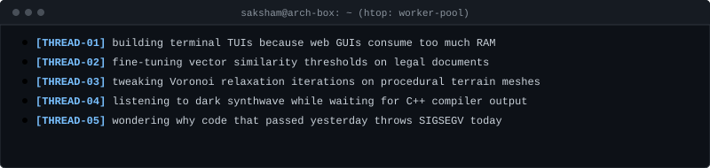

<div align="center">
  
</div>

<br>

<div align="center">
  
</div>

<br>

> I build backend architectures, terminal developer tools, semantic AI experiments, and procedural 3D worlds.
> **Engineering doctrine:** If a manual workflow takes 30 seconds, I will happily spend 14 hours automating it in Python or C++.

<br>

<div align="center">
  
</div>

<br>

---

### 01 // CURRENT THREADS

<div align="center">
  
</div>

<br>

---

### 02 // THINGS THAT ESCAPED THE IDE

```
idea
 └── "this shouldn't take more than 20 minutes"
      └── prototype
           └── 03:00 AM rabbit hole
                └── "wait, this actually works"
                     │
                     ├── LegalEye ........ semantic legal document search
                     ├── CFMate .......... competitive programming terminal CLI
                     ├── CaseCraft ....... terminal test runner with visual diffs
                     ├── HCTS ............ thermodynamics-driven procedural terrain
                     ├── EasyMetro ....... transit graph shortest-path engine
                     └── POSTER .......... retro amber phosphor TUI API client
```

<br>

---

### 03 // SELECTED WORK

**01 / [LEGALEYE](https://github.com/Saksham-cmd-tech/LegelEye)**  
> *Searching legal documents using natural language instead of keyword roulette.*
* **What it is:** A local-first semantic search engine for Indian legal precedent.
* **Why it exists:** Because Boolean keyword queries fail when legal statutes use archaic phrasing.
* **Under the hood:** Python, Sentence Transformers, Vector Search, ChromaDB.
* **State:** Surprisingly effective.

<br>

**02 / [CFMATE](https://github.com/Saksham-cmd-tech/cf_tool)** · [PyPI Package](https://pypi.org/project/cfmate/)  
> *A Codeforces CLI because opening a browser during a contest felt like an unacceptable latency penalty.*

<div align="center">
  
</div>

* **What it is:** A terminal client that fetches problems, caches test cases locally, and executes solutions in Python, C++, Java, or Go.
* **Why it exists:** Browser tabs cause context switching. Terminal windows do not.
* **Under the hood:** Python, Click, Custom Cache Layer, PyPI Distribution.
* **State:** In daily competitive use. `pip install cfmate`

<br>

**03 / [HCTS (ISLAND ENGINE)](https://github.com/Saksham-cmd-tech/terrain_research)**  
> *When standard Perlin noise isn't enough, simulate geology, hydrology, and thermodynamics.*
* **What it is:** A research-oriented procedural world generation system.
* **Why it exists:** Real landmasses have tectonic structure, river basins, and biome gradients—not random mathematical noise.
* **Under the hood:** Voronoi Tessellation, Delaunay Triangulation, Poisson Disk Sampling, Lloyd Relaxation, C++ / Unity.
* **State:** Computationally heavy, visually rewarding.

<br>

**04 / [CASECRAFT](https://github.com/Saksham-cmd-tech/caseRunner)**  
> *A LazyGit-inspired test-case manager for algorithm builders.*
* **What it is:** A terminal UI to manage custom test inputs, inspect memory footprints, monitor execution timeouts (TLE), and highlight diffs between actual and expected outputs.
* **Why it exists:** Debugging algorithm edge-cases via stdout is unnecessarily painful.
* **Under the hood:** Python, TUI Engine, Subprocess Isolation.
* **State:** Active development.

<br>

**05 / [EASYMETRO](https://github.com/Saksham-cmd-tech/easyMetro)**  
> *Because computing Dijkstra on a graph was more reliable than looking at static PDF timetables.*
* **What it is:** Pune Metro transit router with route optimization, interchange penalties, and graph traversal.
* **Why it exists:** Transit network navigation should be instant, offline-capable, and deterministic.
* **Under the hood:** TypeScript, Graph Algorithms, Pathfinding, React.
* **State:** Operational.

<br>

**06 / POSTER**  
> *Because Postman takes 1.2 GB of RAM just to send a GET request.*
* **What it is:** A keyboard-driven, amber phosphor CRT-aesthetic REST client built directly for the terminal.
* **Why it exists:** API testing should feel like operating an underground mainframe, not loading an Electron container.
* **Under the hood:** Python, Textual, HTTP Engine.
* **State:** Fast and lightweight.

<br>

---

### 04 // THINGS THAT PROBABLY DIDN'T NEED TO EXIST

| Experiment | Rationale | Eventual Reality |
| :--- | :--- | :--- |
| **CFMate** | Refused to alt-tab to Chrome during contests | Wrote 1,000+ lines of CLI code to save 3 seconds per problem |
| **POSTER** | Postman took 8 seconds to launch | Built a full retro amber TUI client with Textual instead |
| **youtubeButForMe** | YouTube algorithms kept recommending 4-hour bread documentaries | Built a private frontend with Firebase & React to watch talks in peace |
| **EasyMetro Graph** | Needed to know the exact transfer penalty between lines | Built a full TypeScript graph builder from raw transit stops |

<br>

---

### 05 // RUNTIME LOG :: 02:00 AM THREAD

<div align="center">
  
</div>

<br>

---

### 06 // THE RABBIT HOLES

```
casual question
      │
      ▼
small 10-line script
      │
      ▼
"what if this was faster?"
      │
      ▼
benchmarks & profiling
      │
      ▼
rewriting core algorithms
      │
      ▼
why is this now a full repository on GitHub?
```

<br>

---

### 07 // THE TOOLBOX

```
[LANGUAGES]       Python · C++ · TypeScript · JavaScript · SQL · Bash
[BACKEND]         Node.js · Express · FastAPI · REST APIs · Subprocess Pipelines
[AI & VECTORS]    Sentence Transformers · Vector Embeddings · ChromaDB · NLP
[FRONTEND]        React · Next.js · Vite · Tailwind CSS
[DATABASES]       PostgreSQL · MongoDB · Firebase Firestore · Realtime DB
[DEV & CLI]       Linux · Git · Docker · Textual (TUI) · GDB · Playwright
[CREATIVE 3D]     Blender · Unity · Procedural Mesh Generation · Spatial Algorithms
```

<br>

---

### 08 // SIDE QUEST :: 3D & PROCEDURAL

```
When I step away from backend services and terminal tools, I disappear into
Blender and computational geometry scripts:

  + Procedural terrain synthesis using thermodynamic simulations & Lloyd relaxation
  + Low-poly isometric scenes & digital dioramas
  + 3D interactive web experiences (e.g., Veloran product visualizer)
```

<br>

---

### 09 // SYSTEM TELEMETRY

<div align="center">
  
</div>

<br>

---

### 10 // TRANSMISSION

<details>
<summary><b>[ CLICK TO DECRYPT WISDOM ]</b> <code>$ cat /dev/urandom | grep -m1 "truth"</code></summary>

```
"There are only two hard problems in computer science:
 1. Cache invalidation
 2. Naming things
 3. Off-by-one errors

 ...and explaining why the code worked on localhost:3000."
```
</details>

<br>

---

### 11 // PING & CONNECT

```
GitHub    :: https://github.com/Saksham-cmd-tech
Portfolio :: https://saksham-tale.vercel.app/
PyPI      :: https://pypi.org/project/cfmate/
```

```
================================================================================
  [EOF] Connection closed by remote host.
================================================================================
```
